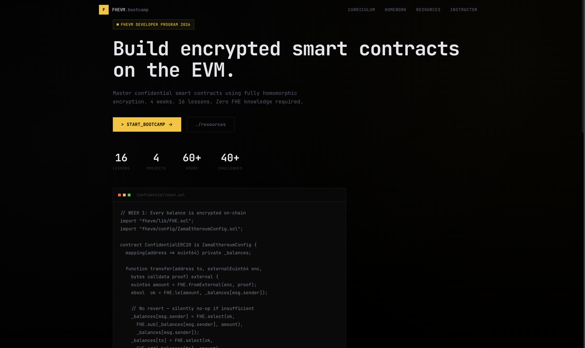
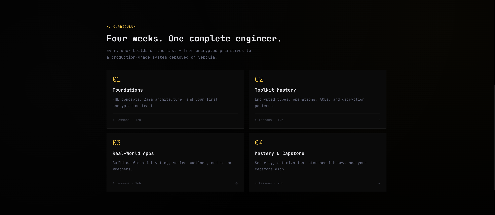
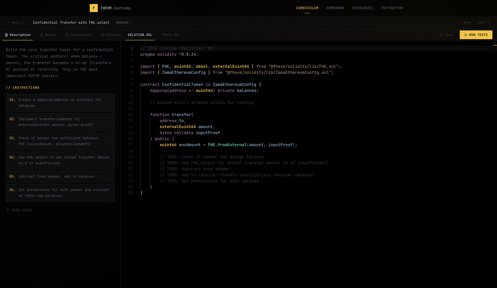
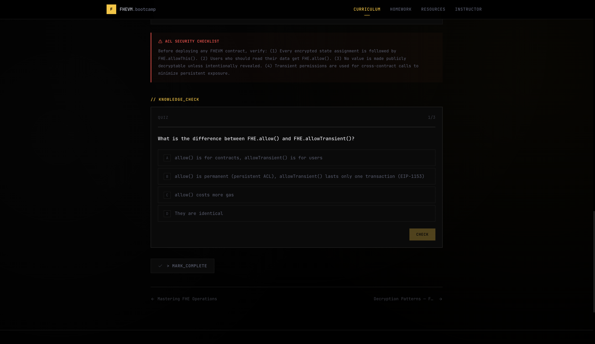

# FHEVM Bootcamp

A comprehensive 4-week developer bootcamp for mastering **Fully Homomorphic Encryption on the EVM** using [Zama Protocol](https://www.zama.ai/). Built as an interactive web platform with lessons, coding challenges, quizzes, and hands-on assignments.

**Live Site:** _Coming soon_



---

## Table of Contents

- [Overview](#overview)
- [Tech Stack](#tech-stack)
- [Getting Started](#getting-started)
- [Project Structure](#project-structure)
- [Curriculum](#curriculum)
- [Features](#features)
- [Design System](#design-system)
- [Content Architecture](#content-architecture)
- [Deployment](#deployment)
- [Contributing](#contributing)
- [License](#license)

---

## Overview

FHEVM Bootcamp is a self-paced learning platform that takes developers from zero FHE knowledge to building production-grade confidential smart contracts. The target audience is **Web3 developers with basic Ethereum/Solidity knowledge** who want to build privacy-preserving applications using Zama's FHEVM.

### What You'll Learn

- How Fully Homomorphic Encryption works on the EVM
- Encrypted types (`euint8`, `euint64`, `ebool`, `eaddress`, etc.)
- FHE operations (`add`, `sub`, `mul`, `select`, `ge`, `le`, etc.)
- Access Control Lists (ACL) and decryption patterns
- Building real dApps: confidential voting, sealed-bid auctions, token wrappers
- Security vulnerabilities, gas optimization, and production patterns

### By the Numbers

| Metric | Count |
|--------|-------|
| Weeks | 4 |
| Lessons | 16 |
| Coding Challenges | 17 |
| Quizzes | 18 |
| Weekly Assignments | 4 |
| Estimated Hours | 60+ |

---

## Tech Stack

| Technology | Version | Purpose |
|------------|---------|---------|
| [Next.js](https://nextjs.org) | 16.1.6 | React framework (App Router, Turbopack) |
| [React](https://react.dev) | 19.2.3 | UI library |
| [TypeScript](https://typescriptlang.org) | 5.x | Type safety |
| [Tailwind CSS](https://tailwindcss.com) | 4.x | Utility-first styling |
| [Monaco Editor](https://microsoft.github.io/monaco-editor/) | 4.7.0 | In-browser Solidity code editor |
| [Lucide React](https://lucide.dev) | 0.577.0 | Icon library |

---

## Getting Started

### Prerequisites

- **Node.js** 18.17 or later
- **npm**, **yarn**, **pnpm**, or **bun**

### Installation

```bash
# Clone the repository
git clone https://github.com/Jemiiah/fhevm-bootcamp.git
cd fhevm-bootcamp

# Install dependencies
npm install

# Start the development server
npm run dev
```

Open [http://localhost:3000](http://localhost:3000) in your browser.

### Available Scripts

| Command | Description |
|---------|-------------|
| `npm run dev` | Start dev server with Turbopack |
| `npm run build` | Create production build |
| `npm run start` | Start production server |
| `npm run lint` | Run ESLint |

---

## Project Structure

```
fhevm-bootcamp/
├── public/
│   └── templates/
│       └── fhevm-dapp-starter/       # Downloadable dApp starter template
├── src/
│   ├── app/                          # Next.js App Router pages
│   │   ├── page.tsx                  # Landing page (hero, curriculum grid, CTA)
│   │   ├── layout.tsx                # Root layout (fonts, metadata)
│   │   ├── globals.css               # Design system (colors, animations, components)
│   │   ├── curriculum/
│   │   │   ├── page.tsx              # Curriculum overview
│   │   │   └── week/[number]/
│   │   │       ├── page.tsx          # Week detail (lessons + challenges list)
│   │   │       ├── lesson/[id]/
│   │   │       │   └── page.tsx      # Lesson page (rich content + quiz)
│   │   │       ├── challenge/[id]/
│   │   │       │   └── page.tsx      # Challenge page (editor + tests)
│   │   │       └── assignment/
│   │   │           └── page.tsx      # Weekly assignment brief
│   │   ├── homework/
│   │   │   └── page.tsx              # Homework overview (all weeks)
│   │   ├── resources/
│   │   │   └── page.tsx              # External links, docs, repos
│   │   └── instructor/
│   │       └── page.tsx              # Instructor guide & teaching tips
│   ├── components/
│   │   ├── ChallengeLayout.tsx       # Split-pane challenge UI (Rustfinity-style)
│   │   ├── CodeEditor.tsx            # Monaco editor with Solidity + FHEVM highlighting
│   │   ├── QuizSection.tsx           # Interactive quiz component
│   │   ├── WeekDetail.tsx            # Week page with lessons/challenges/progress
│   │   ├── TerminalText.tsx          # Typewriter text animation with glitch effect
│   │   ├── OutputConsole.tsx         # Test output display
│   │   ├── Navbar.tsx                # Top navigation bar
│   │   ├── Footer.tsx                # Site footer
│   │   └── ClientProviders.tsx       # Context providers wrapper
│   ├── context/
│   │   └── ProgressContext.tsx        # localStorage-based progress tracking
│   └── lib/
│       ├── curriculum.ts             # Curriculum data (4 weeks, 16 lessons, types)
│       ├── lesson-content.ts         # Rich lesson content (text, code, insights)
│       ├── challenges.ts             # 17 coding challenges with validation rules
│       └── quizzes.ts                # 18 lesson quizzes with questions & answers
├── tailwind.config.ts
├── tsconfig.json
├── next.config.ts
└── package.json
```

---

## Curriculum



### Week 1 — Foundations of FHE & FHEVM

| # | Lesson | Topics |
|---|--------|--------|
| 1 | The Privacy Problem in Public Blockchains | Why privacy matters, FHE vs ZK vs MPC |
| 2 | Zama Protocol Architecture Deep Dive | Co-processor model, threshold decryption, ZamaEthereumConfig |
| 3 | Development Environment Setup & First Contract | Hardhat template, encrypted storage, deployment |
| 4 | Testing FHEVM Contracts & Encrypted I/O | Mock mode, EncryptedInput, test patterns |

**Assignment:** Confidential Vault — Encrypted Deposit & Withdraw

### Week 2 — Encrypted Types, Operations & Access Control

| # | Lesson | Topics |
|---|--------|--------|
| 5 | Complete Guide to Encrypted Types & Type Casting | euint8–256, ebool, eaddress, external types, fromExternal |
| 6 | Mastering FHE Operations | Arithmetic, comparison, bitwise, select pattern |
| 7 | Access Control Lists (ACL) | allowThis, allow, FHE.makePubliclyDecryptable |
| 8 | Decryption Patterns | Sync/async decryption, Gateway callbacks |

**Assignment:** Confidential ERC-20 Token — PrivCoin

### Week 3 — Real-World FHEVM Applications

| # | Lesson | Topics |
|---|--------|--------|
| 9 | Confidential Voting System | Encrypted ballots, tally, result revelation |
| 10 | Sealed-Bid Auction | Blind bidding, encrypted comparisons, winner selection |
| 11 | Confidential Token Wrapper (ERC-7984) | Wrapping ERC-20 into encrypted tokens |
| 12 | Frontend Integration with Relayer SDK | fhevmjs, input encryption, browser integration |

**Assignment:** Confidential DAO Governance — SecretDAO

### Week 4 — Advanced Patterns & Capstone Project

| # | Lesson | Topics |
|---|--------|--------|
| 13 | Zama Standard Library & Production Patterns | ConfidentialERC20, reusable contracts |
| 14 | Security Vulnerabilities in FHEVM | Timing attacks, ciphertext replay, access leaks |
| 15 | Gas Optimization for FHE Operations | Cost model, batching, storage patterns |
| 16 | FHEVM Ecosystem & What's Next | Roadmap, ecosystem projects, career paths |

**Assignment:** Full-Stack Confidential dApp — Capstone

---

## Features

### Interactive Coding Challenges

A Rustfinity-style split-pane coding environment with:

- **Monaco Editor** with custom Solidity + FHEVM syntax highlighting (encrypted types in yellow, FHE calls in cyan)
- **4-tab left panel:** Description, Result, Submissions, Solutions
- **Client-side validation** using regex-based rules (contains, notContains, regex, compiles)
- **Submission history** persisted to localStorage with scores and timestamps
- **Reference solutions** with reveal/hide toggle
- **17 challenges** ranging from Starter to Hard difficulty across all 4 weeks



### Lessons & Quizzes

Each lesson features rich content blocks — formatted text, code examples with copy buttons, KEY INSIGHT callouts, warning blocks, and info notes. Every lesson ends with an interactive quiz for knowledge checks.

- 18 interactive quizzes with multiple-choice questions
- Immediate feedback with correct/incorrect indicators
- Score tracking and explanations for each answer



### Progress Tracking

- localStorage-based completion tracking (no account required)
- Per-lesson and per-challenge completion state
- Progress bar on each week's overview page
- Challenge submission history with scores

### Design

- **Terminal/Hacker aesthetic** — monospace typography, scanline overlay, angular UI elements
- **Zama yellow (#FFC517)** accent color throughout
- **NullPay-inspired dark theme** — true black (#000) base with subtle ambient radial gradients
- **Responsive layout** — works on desktop and mobile
- **Typewriter animation** on headings with glitch character effect
- **Custom scrollbar** and selection colors

---

## Design System

### Color Palette

| Token | Hex | Usage |
|-------|-----|-------|
| Base | `#0A0A0A` | Page background |
| Surface | `#111111` | Cards, panels |
| Surface Alt | `#0D0D0D` | Headers, titlebars |
| Border | `#1a1a1a` | Borders, dividers |
| Border Hover | `#2a2a2a` | Hover states |
| Text Primary | `#FFFFFF` | Headings |
| Text Body | `#E0E0E0` | Body text |
| Text Content | `#C8C8C8` | Descriptions, lesson content |
| Text Meta | `#808080` | Labels, timestamps |
| Text Subtle | `#5A5A5A` | Hints, decorative |
| Accent | `#FFC517` | Zama yellow — CTAs, highlights, active states |
| Cyan | `#00D4AA` | FHE function calls in editor |
| Red | `#FF4444` | Errors, warnings |

### Typography

- **Font:** JetBrains Mono (via `next/font`)
- **Base size:** 14px
- **Line height:** 1.7

### CSS Classes

| Class | Description |
|-------|-------------|
| `.t-card` | Terminal-style card with border |
| `.t-card-window` | Card with titlebar (red/yellow/green dots) |
| `.tag` / `.tag-green` | Badge/label component |
| `.btn-primary` | Yellow CTA button |
| `.btn-outline` | Ghost button with border |
| `.section-label` | Uppercase yellow section header |
| `.scanline` | CRT scanline overlay |
| `.prompt` | Terminal `>` prefix |
| `.stagger` | Staggered fade-in animation for children |

---

## Content Architecture

All educational content is stored as TypeScript data in `src/lib/`:

| File | Lines | Description |
|------|-------|-------------|
| `curriculum.ts` | 694 | Week/Lesson/Homework structure and metadata |
| `lesson-content.ts` | 1,362 | Rich content blocks for all 16 lessons |
| `challenges.ts` | 1,812 | 17 challenges with starter/solution code and validation |
| `quizzes.ts` | 639 | 18 quizzes with questions, options, and explanations |

### Content Block Types

Lessons use a typed `ContentBlock` system:

```typescript
type ContentBlock =
  | { type: "text"; body: string }           // Markdown-like text
  | { type: "code"; language: string; filename?: string; body: string }
  | { type: "insight"; title: string; body: string }   // Yellow callout
  | { type: "warning"; title?: string; body: string }  // Red callout
  | { type: "info"; body: string }           // Blue callout
  | { type: "list"; title: string; items: string[] }   // Numbered list
```

### Challenge Validation

Challenges use client-side regex validation:

```typescript
interface ValidationRule {
  type: "contains" | "notContains" | "regex" | "compiles";
  value: string;
  name: string;
  points: number;
}
```

---

## Deployment

### Vercel (Recommended)

```bash
npm install -g vercel
vercel
```

Or connect the GitHub repository to [Vercel](https://vercel.com) for automatic deployments.

### Docker

```dockerfile
FROM node:20-alpine AS builder
WORKDIR /app
COPY package*.json ./
RUN npm ci
COPY . .
RUN npm run build

FROM node:20-alpine AS runner
WORKDIR /app
COPY --from=builder /app/.next/standalone ./
COPY --from=builder /app/.next/static ./.next/static
COPY --from=builder /app/public ./public
EXPOSE 3000
CMD ["node", "server.js"]
```

### Environment

No environment variables are required. All content is static and bundled at build time.

---

## Contributing

1. Fork the repository
2. Create a feature branch (`git checkout -b feat/your-feature`)
3. Make your changes
4. Run lint checks (`npm run lint`)
5. Commit with a descriptive message
6. Push and open a Pull Request

### Adding a New Lesson

1. Add the lesson metadata to `src/lib/curriculum.ts` in the appropriate week
2. Add rich content blocks to `src/lib/lesson-content.ts`
3. Add a quiz to `src/lib/quizzes.ts`

### Adding a New Challenge

1. Add the challenge object to `src/lib/challenges.ts` with:
   - `starterCode` — initial code shown in the editor
   - `solutionCode` — reference solution
   - `testCode` — displayed in the tests tab
   - `validationRules` — array of regex-based validation rules

---

## License

This project is private. All rights reserved.

---

Built with [Next.js](https://nextjs.org) and [Zama FHEVM](https://www.zama.ai/fhevm).
